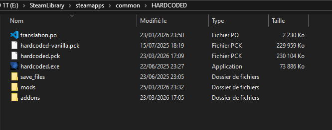
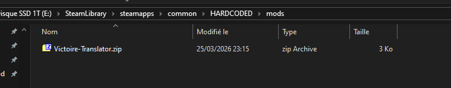
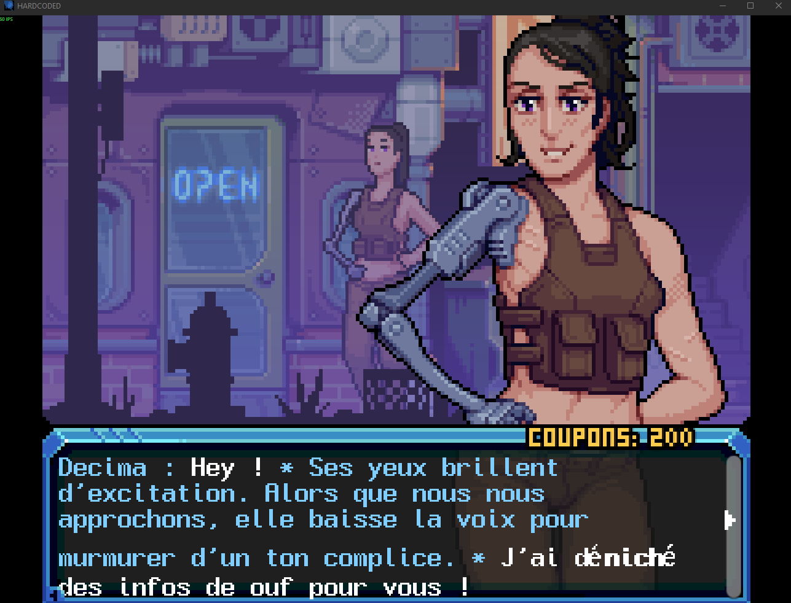

# What's this mod ?

This mod makes the game [HARDCODED](https://store.steampowered.com/app/2693710/HARDCODED/) mostly translatable in ANY language.   
I still didn't made any translation myself, but I hope the community will contribute to it !  
If you are not afraid of being spoiled and want to help translate it for others people, there is a tutorial [here](#translation).

# Installation
1. This mod use Godot Mod Loader to works.   
So first of all you need to follow [this tutorial](https://wiki.godotmodding.com/guides/integration/mod_loader_self_setup/#mod-loader-self-setup) to make your HARDCODED game able to load mods
2. Once it's done, you can download this mod as a .zip [here](https://github.com/Pholith/HARDCODED_Translation_Mod/releases/download/latest/Victoire-Translator.zip), create a `mods/` folder next to `hardcoded.exe`, and put it in. *(On Windows, it's located here: `E:\SteamLibrary\steamapps\common\HARDCODED`)*
3. You now can put any translation of your language named as `translation.po` next hardcoded.exe.  
Translation can be found on the git here or in the hardcoded discord server
4. Finally your game folder should look like this:

It's done !
If you have any error, you can check the logs in:
`C:\Users\******your_user_windows******\AppData\Roaming\Godot\app_userdata\HARDCODED\logs`

# Translation
You want to translate this game ? Thanks that's really cool !   

In the github source repository, you will find a [file named translation_template.pot](https://github.com/Pholith/HARDCODED_Translation_Mod/blob/main/translation_template.pot).   
This file contains most of the strings of the game, you can open it using [POEdit](https://poedit.net/) or any [similar software](https://alternativeto.net/software/poedit/).
   
On POedit you will be able to generate a .po file of your language using the .pot template.

# Example
Example with a french translation.

